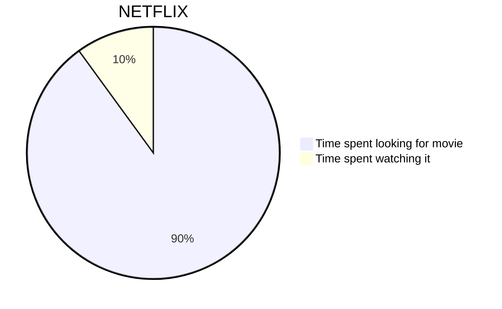

# MermaidJS CSS

[Source](C:\Users\baile\SourceControl\obisidian-work-template\.obsidian\snippets\mermaidjs_tweaks.css)

```mermaid
pie title NETFLIX
         "Time spent looking for movie" : 90
         "Time spent watching it" : 10
```
